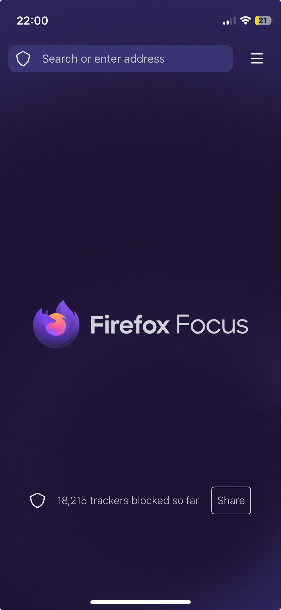

# Concept: Firefox Focus trackers blocked metric

'Trackers blocked' shows the number of website trackers blocked by the browser since the browser was installed.

It is the only metric exposed by the Mozilla Firefox Focus web browser.

The trackers blocked number is updated automatically.

There is no option to reset this metric.

Firefox Focus' tracking protection uses [Disconnect's Tracking protection list](https://disconnect.me/trackerprotection).
Disconnect is company that provides privacy and security protecting tools, including a blocklist of non-consensual third party trackers.

You can [see the full list on GitHub](https://github.com/disconnectme/disconnect-tracking-protection).

## Definition of tracking

[Disconnect defines tracking](https://disconnect.me/trackerprotection) as:

> Tracking is the collection of data regarding a particular user's or device's activity across multiple websites or applications that aren’t owned by the data collector, and the retention, use or sharing of that data. We will also classify as trackers domains which collect, share, retain, or use data to enable tracking by other services.

## Background

Firefox Focus is a single tab browser designed for privacy and performance.

Each time the browser is closed, the tab's history and cookies are erased.
All information about the session may also be deleted by tapping the trash can icon in the toolbar.

Mozilla launched Firefox Focus as a minimalist web browser in 2016.
The tool directly enables [Mozilla's 4th Principle](https://www.mozilla.org/en-GB/about/manifesto/): "Individuals’ security and privacy on the internet are fundamental and must not be treated as optional."

By safeguarding privacy, Firefox Focus enables a user to opt out of surveillance capitalism.

The 'share' button next to the trackers blocked metric encourages users to celebrate their choice of tool.
It automatically generates this text as an endorsement:

> Firefox Focus, the privacy browser from Mozilla, has already blocked _n_ trackers for me. Fewer ads and trackers following me around means faster browsing! Get focus for yourself here [link]

## Use cases

By blocking trackers, webpages load faster and data generated by a browsing session stays private.

Firefox Focus is often recommended as a tool to support [digital minimalism](https://calnewport.com/on-digital-minimalism/).

It may also be used as a sandbox when opening a potentially suspicious webpage.

## Related resources

* [Download Firefox Focus](https://www.firefox.com/en-US/browsers/mobile/focus/)
* [Firefox Focus support](https://support.mozilla.org/en-US/products/focus-firefox)

## References consulted to create this guide

* [What is Firefox Focus for iOS?](https://support.mozilla.org/en-US/kb/firefox-focus-ios), Mozilla Support [support webpage]
* [About Mozilla](https://www.mozilla.org/en-GB/about/), Mozilla [webpage]
* [Disconnect tracker protection](https://disconnect.me/trackerprotection), Disconnect [webpage]
* [Disconnect tracking protection](https://github.com/disconnectme/disconnect-tracking-protection), Disconnect, [GitHub repo]
* [On digital minimalism](https://calnewport.com/on-digital-minimalism/), Cal Newport [blogpost]
* [Attention management](https://en.wikipedia.org/wiki/Attention_management), Wikipedia [webpage]
* [Cal Newport](https://en.wikipedia.org/wiki/Cal_Newport), Wikipedia [webpage]
* [Surveillance capitalism](https://en.wikipedia.org/wiki/Surveillance_capitalism) Wikipedia [webpage]
* [Firefox Focus](https://en.wikipedia.org/wiki/Firefox_Focus), Wikipedia [webpage]
* [Tip for smartphone addicts: Firefox Focus browser](https://www.reddit.com/r/digitalminimalism/comments/wnbyl0/tip_for_smartphone_addicts_firefox_focus_browser/) [Reddit post]
* [Concept template](https://gitlab.com/tgdp/templates/-/tree/main/concept?ref_type=heads), The Good Docs Project [GitLab repo]
